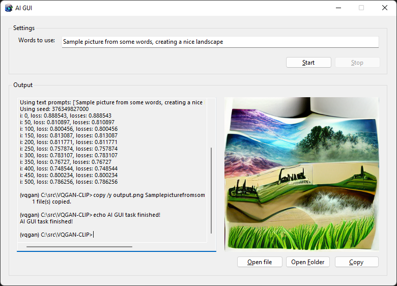

# AI-GUI
Simple GUI for some AI image-from-text projects
(C) 2022 Jussi Salin with GPLv2 license

It is written as .NET 6.0 Forms Application in VS 2022. Currently hardcoded to work only with VQGAN-CLIP project with help of Anaconda, on Windows.

Future plans are to add tabs for other AI projects than VQGAN, which have different command lines and different settings. Also I plan to add more VQGAN settings fields to the UI, like resolution, as time goes and I have personal need. The output console and image preview would be shared between all different projects though.